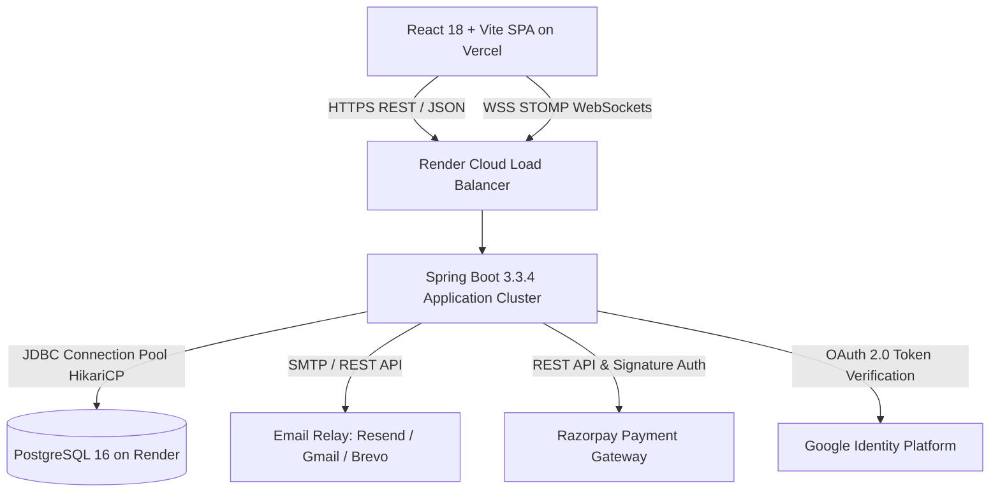
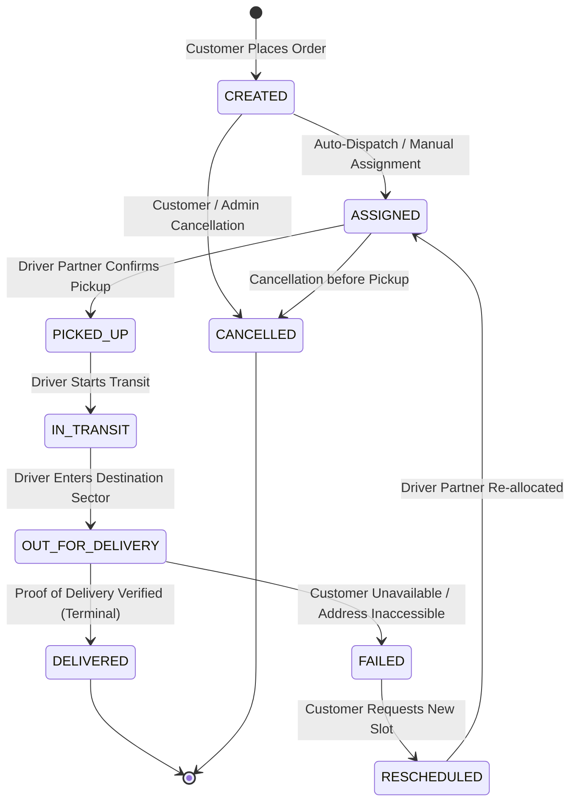
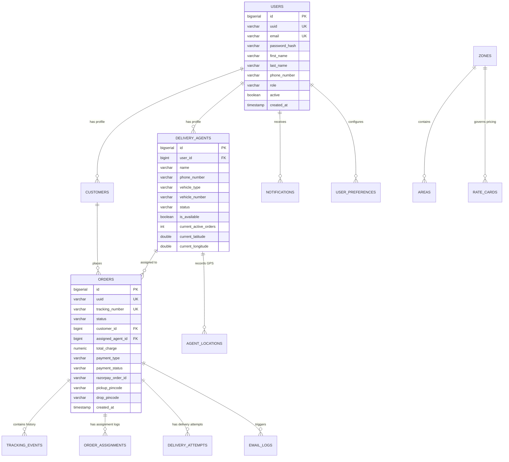

# 📦 Ship It Logistics Platform — System Architecture & Technical Design Document

> **Author**: Rakshit Pandey  
> **Version**: 2.0.0 (Production Release)  
> **Repository**: [rakshitp18/Last-Mile-Delivery-Tracker](https://github.com/rakshitp18/Last-Mile-Delivery-Tracker)  
> **Production Endpoints**:
> - **Backend API**: `https://shipit-sl8q.onrender.com`
> - **Frontend Web App**: `https://last-mile-delivery-tracker-9t8c.vercel.app`

---

## 1. Executive Summary

**GATIMAN** is an enterprise-grade, real-time last-mile logistics and dispatch orchestration platform tailored for urban delivery corridors (Delhi NCR reference model). It bridges customers, dispatch administrators, and field delivery driver partners through an event-driven architecture featuring automated route assignment, multi-factor volumetric billing, real-time GPS telemetry, and milestone-triggered notifications.



---

## 2. High-Level System Architecture

### 2.1 Layered Architectural Topology

GATIMAN implements a clean, domain-driven 4-tier architecture:

```
┌────────────────────────────────────────────────────────────────────────┐
│                        PRESENTATION TIER (SPA)                         │
│  React 18 • TypeScript • Tailwind CSS • TanStack Query • Lucide Icons │
│  • Customer Booking Wizard • Driver Run Sheet • Admin Mission Control  │
└───────────────────────────────────┬────────────────────────────────────┘
                                    │ HTTPS (REST) / WSS (STOMP)
┌───────────────────────────────────▼────────────────────────────────────┐
│                         API GATEWAY & SECURITY                         │
│  Spring Security 6 • JWT Stateless Auth (HMAC-SHA512) • CORS Filter    │
│  Rate Limiting • Role-Based Access Control (ADMIN, DRIVER, CUSTOMER)  │
└───────────────────────────────────┬────────────────────────────────────┘
                                    │
┌───────────────────────────────────▼────────────────────────────────────┐
│                          APPLICATION & DOMAIN                          │
│  Order Orchestrator • Dispatch FSM • Dynamic Pricing Engine            │
│  Driver Allocation Algorithm • Live Telemetry Broker • Notification Hub│
└───────────────────────────────────┬────────────────────────────────────┘
                                    │ JPA / Hibernate 6 (HikariCP)
┌───────────────────────────────────▼────────────────────────────────────┐
│                           PERSISTENCE TIER                             │
│  Render Managed PostgreSQL 16 • 17 Relational Tables • ACID Invariants │
└────────────────────────────────────────────────────────────────────────┘
```

---

## 3. Core Subsystems & Domain Logic

### 3.1 Finite State Machine (FSM) Order Lifecycle

Order status transitions are strictly governed by `OrderStatusTransitionServiceImpl`, enforcing immutable transition boundaries and preventing out-of-order state mutations:



#### Valid Transition Matrix:
| From Status | Permitted Next Statuses | Action Trigger |
| :--- | :--- | :--- |
| `CREATED` | `ASSIGNED`, `CANCELLED` | Dispatch engine assigns driver |
| `ASSIGNED` | `PICKED_UP`, `OUT_FOR_DELIVERY`, `CANCELLED` | Driver marks parcel picked up |
| `PICKED_UP` | `IN_TRANSIT` | Driver begins transit |
| `IN_TRANSIT` | `OUT_FOR_DELIVERY` | Driver approaches destination sector |
| `OUT_FOR_DELIVERY` | `DELIVERED`, `FAILED` | Successful delivery or failure logged |
| `FAILED` | `RESCHEDULED` | Customer/Admin reschedules delivery |
| `RESCHEDULED` | `ASSIGNED` | Order queued for new driver dispatch |
| `DELIVERED` | *None (Terminal)* | Order completed |
| `CANCELLED` | *None (Terminal)* | Order cancelled |

---

### 3.2 Dynamic Multi-Factor Pricing Engine

Freight charges are calculated in `PricingServiceImpl` using volumetric weight versus actual dead-weight comparison, base slab rates, incremental step charges, and dynamic zone surcharges:

$$\text{Volumetric Weight (kg)} = \frac{\text{Length (cm)} \times \text{Breadth (cm)} \times \text{Height (cm)}}{5000}$$

$$\text{Billable Weight} = \max(\text{Actual Dead Weight}, \text{Volumetric Weight})$$

$$\text{Total Charge} = \text{Base Slab Rate} + \left(\lceil\text{Billable Weight} - \text{Base Weight}\rceil \times \text{Additional Rate per Kg}\right) + \text{Zone Surcharges}$$

---

### 3.3 Driver Assignment Algorithm

Dispatch allocation (`AgentAssignmentServiceImpl`) operates in two modes:

1. **Auto-Dispatch Algorithm**:
   - Computes Haversine great-circle distance between driver coordinates and pickup coordinates.
   - Filters active drivers (`status = ACTIVE`, `isAvailable = true`, `currentActiveOrders < maxCapacity`).
   - Weighs vehicle suitability against shipment weight:
     - `EV_SCOOTER`: $\le 15\text{ kg}$
     - `CAR`: $\le 60\text{ kg}$
     - `TEMPO`: $> 60\text{ kg}$
   - Selects the driver with the minimal composite score:
     $$\text{Score} = (\text{Distance in km} \times 0.6) + (\text{Active Orders Load} \times 0.4)$$
2. **Manual Override Dispatch**:
   - Administrative mission control allows direct assignment/reassignment to any active driver with immediate audit logging and push notification.

---

### 3.4 Real-Time WebSocket Telemetry Pipeline

High-frequency GPS updates use STOMP over Native WebSockets:
- **Broker Endpoint**: `/ws` (with automatic fallback)
- **Topics**:
  - `/topic/orders/{orderId}/tracking`: High-frequency driver latitude, longitude, speed, and ETA.
  - `/topic/orders/{orderId}/status`: Milestone status updates.
  - `/topic/orders`: Global order event feed for Admin Mission Control.
- **Concurrency Optimization**: `telemetryCache` utilizes `ConcurrentHashMap` for high-frequency GPS ticks, eliminating database write bottlenecks during peak transit.

---

### 3.5 Automated Notification & Email Subsystem

Automated milestone notifications run on an isolated asynchronous pipeline:
- **Relay Support**: Gmail App Passwords (Port 587 TLS), Resend REST API, Brevo SMTP.
- **Idempotency**: Prevents duplicate email dispatch using SHA-256 idempotency hashing (`buildIdempotencyKey(eventType, order)`).
- **Audit Logging**: Persists all transmissions, delivery timestamps, failure diagnostics, and rendered HTML payloads to `email_logs`.
- **Admin Hub**: Live email inspection, search, visual template gallery, and one-click retry for failed deliveries.

---

### 3.6 Payment Architecture (Razorpay & COD)

- **Online Payments**:
  1. Frontend calls `POST /api/payments/razorpay/create-order`.
  2. Backend generates authoritative Razorpay Order ID and records it in atomic database transaction.
  3. Customer completes checkout via Razorpay modal.
  4. Frontend sends `razorpay_payment_id`, `razorpay_order_id`, and `razorpay_signature`.
  5. Backend verifies authenticity via **HMAC-SHA256** checksum verification:
     $$\text{HMAC\_SHA256}(\text{order\_id} + "|" + \text{payment\_id}, \text{secret})$$
  6. Upon verification, payment status advances to `PAID` and order unlocks for automated driver assignment.
- **Postpaid / Cash on Delivery (COD)**:
  - Supports immediate order confirmation with payment collection required upon delivery.

---

## 4. Database Entity-Relationship Model

The PostgreSQL database encompasses **17 core tables** with comprehensive foreign keys, indexes, and audit timestamps:



---

## 5. Security Architecture

1. **Stateless JWT Authentication**:
   - Access tokens generated using 512-bit HMAC (`HS512`) with 24-hour expiration.
   - Claims include `userId`, `uuid`, `roles`, and `sub` (email).
2. **Password Security**:
   - `BCryptPasswordEncoder` (work factor 12) with salted hashing.
3. **CORS & Origin Policies**:
   - Configured via `CorsConfigurationSource` with dynamic pattern matching (`https://*.vercel.app`, `https://*.onrender.com`, `http://localhost:*`).
4. **Role-Based Access Control (RBAC)**:
   - Method-level `@PreAuthorize("hasRole('ADMIN')")`, `@PreAuthorize("hasAnyRole('DRIVER', 'ADMIN')")`.

---

## 6. Frontend Architecture & Design System

### 6.1 Technology Stack
- **Framework**: React 18 + Vite
- **Language**: TypeScript 5.5
- **State & Server Cache**: TanStack React Query v5
- **Icons**: Lucide React
- **Styling**: Tailwind CSS with custom typography tokens

### 6.2 Design Tokens & Visual Hierarchy
- **Primary Sans**: `Plus Jakarta Sans` (Crisp geometric interface text)
- **Heading / Display**: `Space Grotesk` (Technical modern executive headers)
- **Data / Metrics**: `JetBrains Mono` (High-density telemetry, tracking IDs, timestamps)
- **Accent Palette**:
  - Indigo / Violet: Primary actions & branding (`#4F46E5`, `#7C3AED`)
  - Emerald: Positive milestones, live on-duty status (`#059669`)
  - Amber / Orange: Transit in progress, pending items (`#D97706`)
  - Slate / Zinc: Dark mode telemetry cards & subtle glassmorphic borders

---

## 7. Cloud Deployment & CI/CD Topology

```
┌────────────────────────────────────────────────────────┐
│                   GITHUB REPOSITORY                    │
│      Milindverma24 / Last_mile_tracker_vitb (main)     │
└───────────────┬────────────────────────┬───────────────┘
                │ Webhook Push           │ Webhook Push
┌───────────────▼──────────────┐ ┌───────▼──────────────┐
│        RENDER CLUSTER        │ │     VERCEL EDGE      │
│  • gatiman-backend (Docker)  │ │  • Static React SPA  │
│  • gatiman-db (PostgreSQL 16)│ │  • Global Edge CDN   │
│  • Port 8088                 │ │  • Instant Rollouts  │
└──────────────────────────────┘ └──────────────────────┘
```

### Environment Configuration Map:
| Environment Variable | Location | Description |
| :--- | :--- | :--- |
| `DATABASE_URL` | Backend | PostgreSQL JDBC connection string |
| `JWT_SECRET` | Backend | 512-bit secret for signing auth tokens |
| `EMAIL_ENABLED` | Backend | Toggle for milestone notification engine |
| `RAZORPAY_KEY_ID` | Backend & Frontend | Razorpay public integration key |
| `RAZORPAY_KEY_SECRET` | Backend | Razorpay private cryptographic secret |
| `VITE_API_URL` | Frontend | Production REST API base endpoint |
| `VITE_WS_URL` | Frontend | Production STOMP WebSocket endpoint |

---

## 8. Summary of System Capabilities

| Capability | Implementation | Status |
| :--- | :--- | :--- |
| **Order Booking Wizard** | 4-step responsive stepper with dynamic volumetric calculator | ✅ Production |
| **Payment Gateway** | Razorpay checkout + HMAC-SHA256 verification + COD fallback | ✅ Production |
| **Driver Run Sheet** | Instant optimistic mutations + offline/online duty toggle | ✅ Production |
| **Live GPS Telemetry** | WebSocket STOMP broadcast with 3-second auto-poll fallback | ✅ Production |
| **Email Notification Hub**| Multi-relay dispatch, audit log table, visual template gallery | ✅ Production |
| **Admin Mission Control** | Fleet overview, revenue analytics, driver manual override | ✅ Production |
