<div align="center">

# 📦 Ship It — Enterprise Last-Mile Delivery & Dispatch Platform

[](https://last-mile-delivery-tracker-9t8c.vercel.app)
[](https://shipit-sl8q.onrender.com)
[](https://www.postgresql.org/)
[](https://spring.io/projects/spring-boot)
[](https://react.dev/)
[](https://www.typescriptlang.org/)
[](LICENSE)

**An enterprise-grade real-time last-mile logistics orchestration platform featuring deterministic volumetric rating, sub-second GPS telemetry radar, automated proximity-based fleet pairing, and multi-tenant operational consoles for Admins, Drivers, and Customers.**

[🌐 Live Web Application](https://last-mile-delivery-tracker-9t8c.vercel.app) • [🔌 Live REST API](https://shipit-sl8q.onrender.com/api/health) • [📖 Architecture Document](DESIGN.md)

---

</div>

## 📸 Complete Platform Showcase

---

### 🌟 1. Public Portal & Customer Experience

#### Interactive Landing Page & 3D Logistics Hero
> Modern light-themed SaaS landing interface with integrated 3D conveyor belt mechanics and immediate booking CTAs.

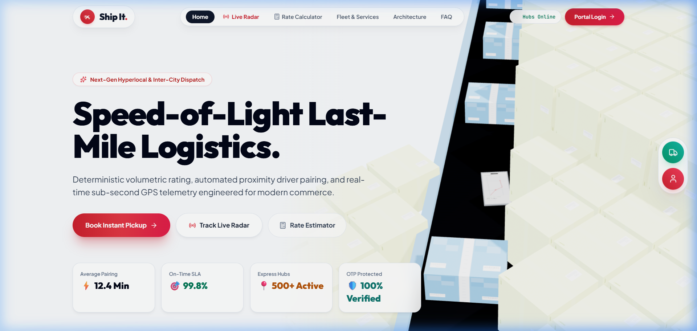

#### Real-Time Parcel Radar & Telemetry Cockpit
> Sub-second tracking with live driver coordinates, corridor milestone progress, and automated ETA countdowns.

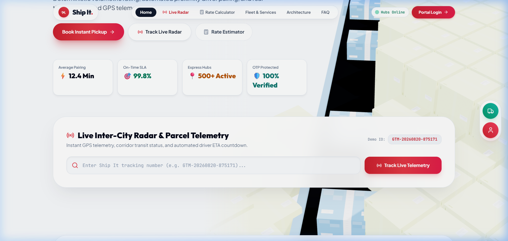

#### Dynamic Volumetric Rate Calculator
> Instant billable weight computation using standard dimensional freight formulas (`(L × B × H) / 5000`) with real-time price estimation across delivery zones.

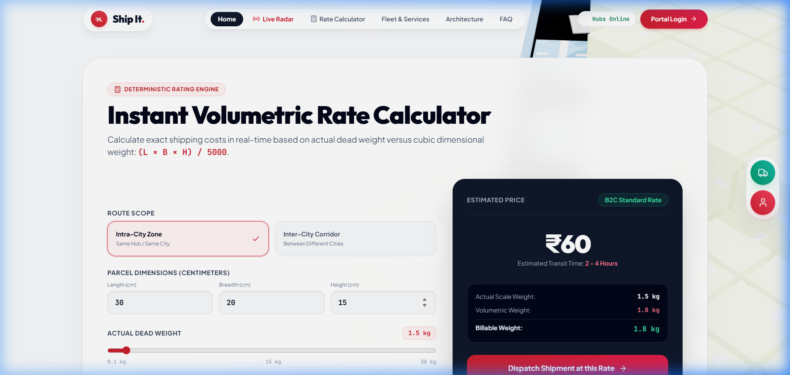

#### Multi-Modal Fleet & Corridor Services
> Horizontally scrollable fleet showcase spanning Inter-City Express, Urban Hyperlocal, Heavy B2B Freight, and EV clean fleets.

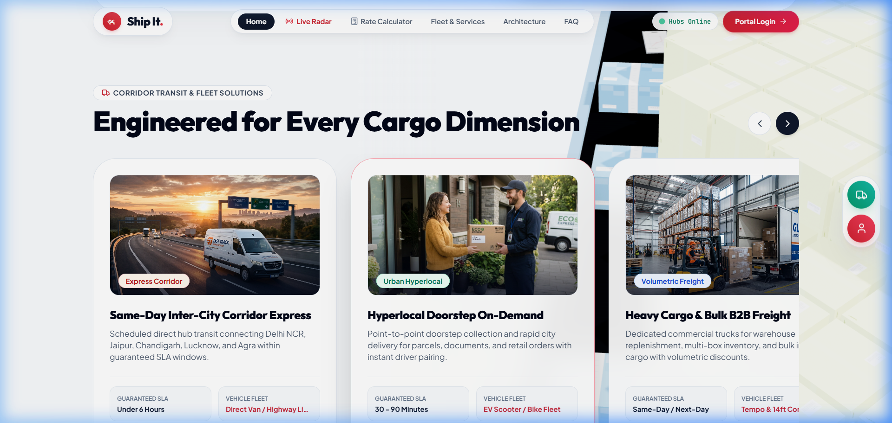

---

### 🏢 2. Enterprise Operations & Admin Dispatch Console

#### Operations Cockpit & Executive KPIs
> Centralized dispatch hub for active bookings, in-transit telemetry, available driver capacity, and billing analytics.

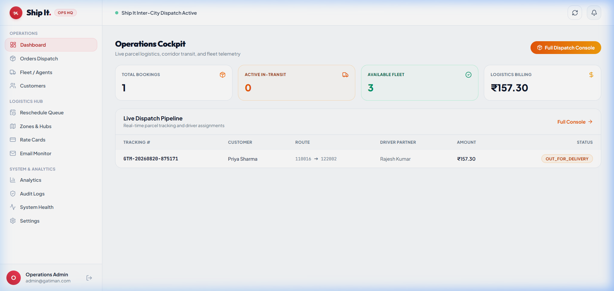

#### Live Dispatch & Order Pipeline
> Real-time shipment queue with route matching, weight tier classification, assigned driver partner tracking, and status inspection.

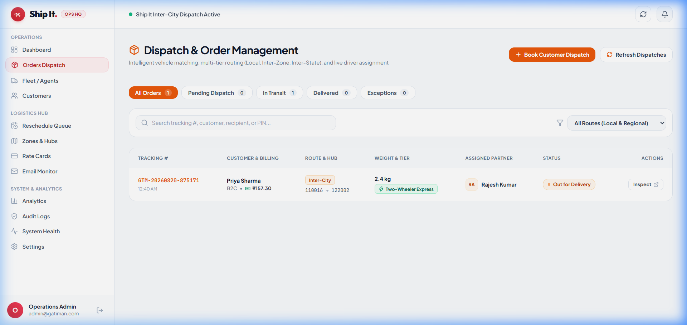

#### Fleet & Driver Partner Management
> Real-time multi-tier dispatch network, vehicle telemetry, payload capacities, active load quotas, and on-duty controls.

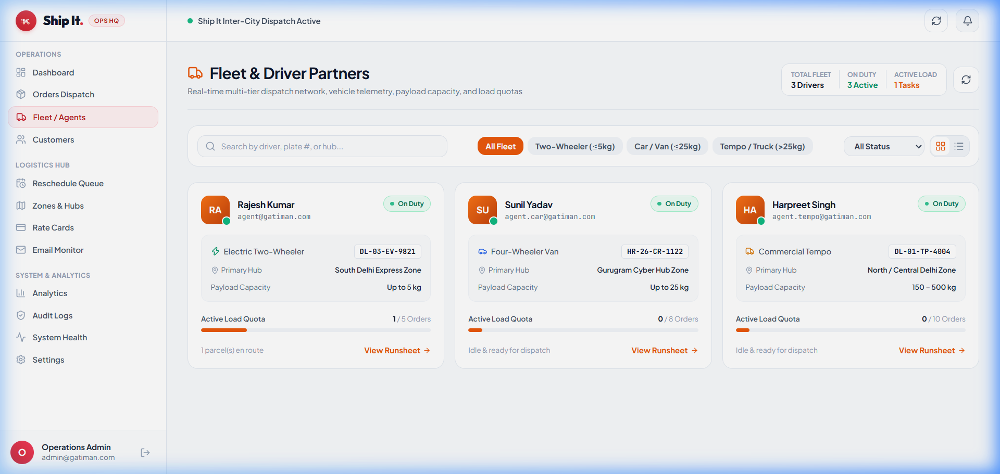

#### Dynamic Rate Cards & Zone Matrix
> Configurable rate slabs, volumetric multipliers, COD surcharges, and interactive live billing simulator.

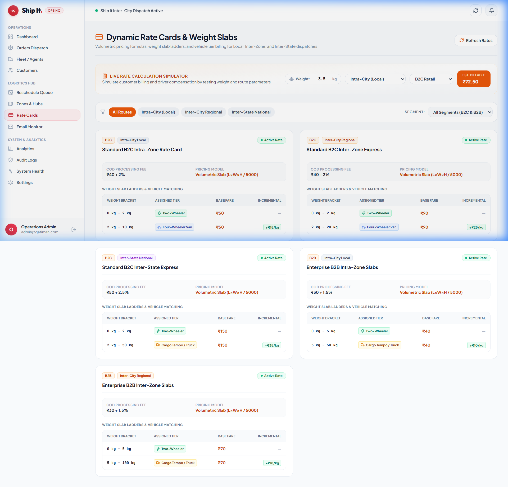

---

### 🚚 3. Field Delivery Driver App

#### Driver Run Sheet & Live Assignments
> Mobile-responsive driver portal displaying assigned pickup/drop details, customer contact triggers, on-duty toggles, and direct completion actions.

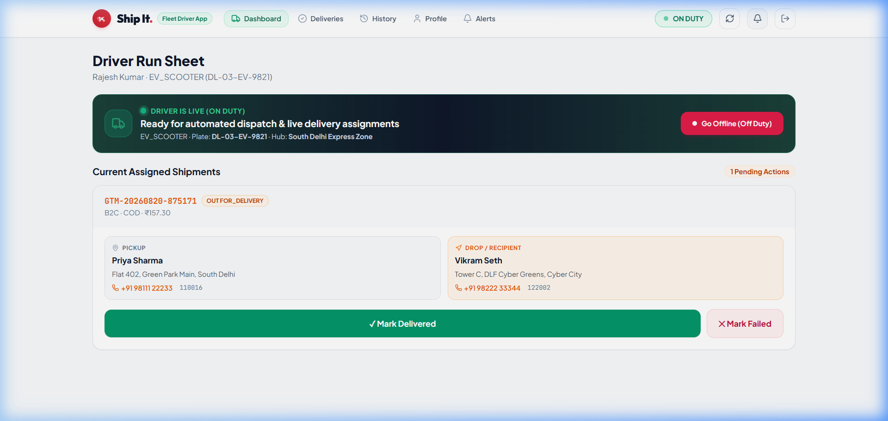

---

### 👤 4. Customer Self-Service & Booking Wizard

#### 6-Step Guided Shipment Booking
> Intuitive shipment creation workflow with address auto-complete, multi-box dimensional configuration, rate estimation, and instant payment checkout.

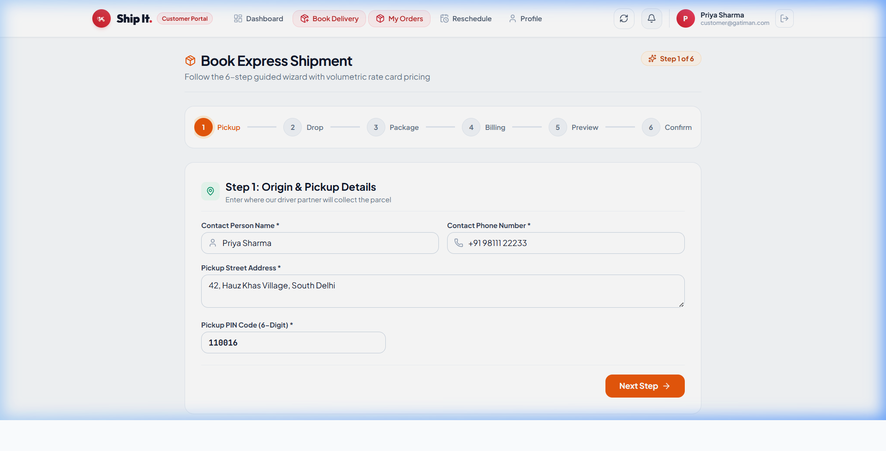

#### Multi-Role Authentication Portal
> Seamless sign-in with Google OAuth 2.0 Identity Services, role-based demo accounts, and encrypted JWT credential exchange.

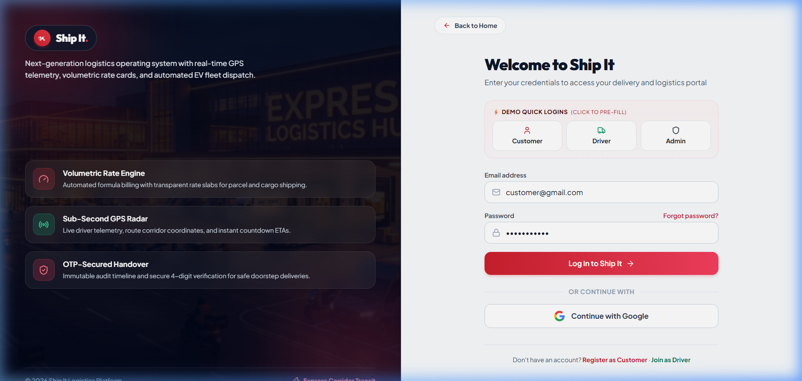

---

## 🌟 Key Platform Capabilities

- 🏎️ **Deterministic Volumetric Rating Engine**: Computes billable freight weight as `max(Dead Weight, (L × B × H) / 5000)` with customizable base rates, distance tiers, and COD handling fees.
- 📡 **Real-Time GPS Telemetry & STOMP WebSockets**: Instant driver location streaming over WebSockets with live Leaflet map rendering and milestone status transitions.
- 🤖 **Automated Driver Dispatching**: Nearest-available delivery agent pairing based on operational zones and driver vehicle capacities.
- 🔐 **Dual Authentication & Security**: Stateless JWT authentication with BCrypt hashing and Google OAuth 2.0 Identity Services.
- 💳 **Razorpay Payment Integration**: Integrated test and live payment checkout with instant webhook verification.
- 📧 **Multi-Channel Email Notifications**: Transactional booking confirmations, dispatch alerts, OTP delivery verification, and rescheduling receipts via Gmail SMTP and Resend API.
- 📱 **Progressive Web App (PWA)**: Mobile-optimized experience with service workers, offline manifest caching, and native responsive design.

---

## 🏗️ System Architecture

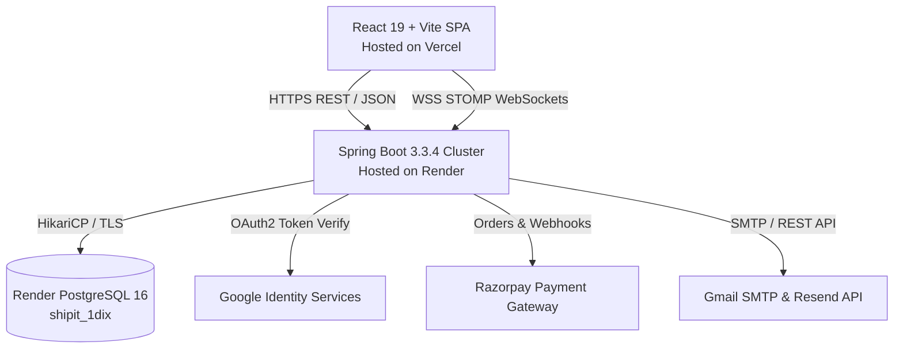

---

## 🛠️ Technology Stack

| Layer | Technologies & Libraries |
| :--- | :--- |
| **Frontend** | React 19, TypeScript, Vite, Tailwind CSS, Lucide Icons, Three.js, Leaflet, Recharts, TanStack Query |
| **Backend** | Java 17, Spring Boot 3.3.4, Spring Security, Spring Data JPA, Spring WebSocket (STOMP), Hibernate |
| **Database** | PostgreSQL 16 (Render Managed), HikariCP Connection Pool |
| **Authentication** | JWT (JSON Web Tokens), Google OAuth 2.0, BCrypt |
| **Third-Party APIs** | Razorpay (Payments), Gmail SMTP / Resend (Email), OpenStreetMap / Leaflet (Maps) |
| **Hosting & Cloud** | Vercel (Frontend SPA), Render (Spring Boot Docker Web Service & Managed PostgreSQL) |

---

## 🚀 Quick Start Guide

### Prerequisites
- Java 17+ & Maven 3.8+
- Node.js 18+ & npm 9+
- PostgreSQL 16 (or local Docker)

---

### 1. Clone the Repository
```bash
git clone https://github.com/rakshitp18/Last-Mile-Delivery-Tracker.git
cd Last-Mile-Delivery-Tracker
```

---

### 2. Run with Docker Compose (Fastest)
```bash
docker-compose up --build
```
- Frontend: `http://localhost:5173`
- Backend API: `http://localhost:8088/api`
- PostgreSQL: `localhost:5432`

---

### 3. Run Manually (Local Development)

#### Backend (Spring Boot):
```bash
cd backend
./mvnw spring-boot:run
```
*(Runs on `http://localhost:8088` with embedded H2 in PostgreSQL compatibility mode).*

#### Frontend (React + Vite):
```bash
cd frontend
npm install
npm run dev
```
*(Runs on `http://localhost:5173` with instant Vite hot module replacement).*

---

## 🔑 Demo Access Credentials

| Role | Email | Password | Permissions |
| :--- | :--- | :--- | :--- |
| **Operations Admin** | `admin@gatiman.com` | `admin` | Full dispatch console, fleet assignment, rate card configuration, system audit logs |
| **Enterprise Customer** | `customer@gatiman.com` | `customer` | Booking creation, volumetric calculator, order history, live tracking |
| **Delivery Driver** | `agent@gatiman.com` | `agent` | Active parcel acceptance, status updating, OTP-protected delivery confirmation |

---

## 📡 REST API Reference

| Method | Endpoint | Description | Auth Required |
| :--- | :--- | :--- | :--- |
| `POST` | `/api/auth/login` | Authenticate and obtain JWT token | ❌ Public |
| `POST` | `/api/auth/google` | Google OAuth token exchange | ❌ Public |
| `GET` | `/api/orders/track/{trackingNumber}` | Public parcel telemetry lookup | ❌ Public |
| `POST` | `/api/orders` | Create shipment booking | ✅ Customer / Admin |
| `GET` | `/api/orders/my-orders` | Fetch customer shipments | ✅ Customer |
| `PATCH` | `/api/agent/orders/{id}/status` | Update delivery state & coordinates | ✅ Delivery Driver |
| `GET` | `/api/admin/dashboard/stats` | Aggregate operations KPIs | ✅ Admin |
| `GET` | `/api/health` | Service health status check | ❌ Public |

---

## 📄 License & Author

Authored by **[Rakshit Pandey](https://github.com/rakshitp18)**.

This project is licensed under the [MIT License](LICENSE) — see the LICENSE file for details.
